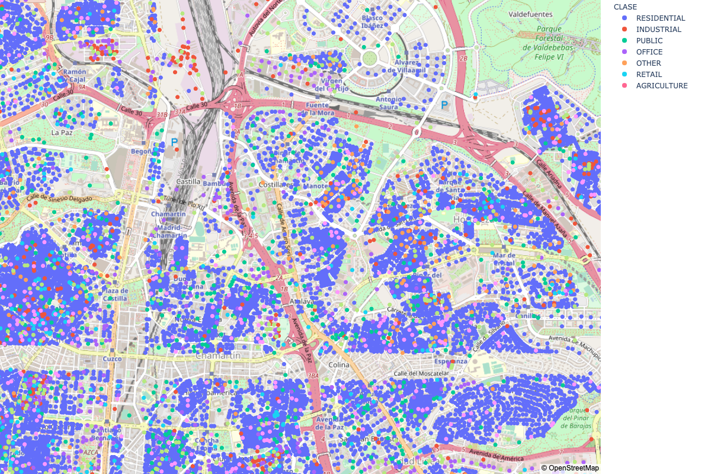

## Creación de variables

Generamos de forma sintética múltiples variabels que intentan facilitar el aprendizaje de los modelos 
explicitando el contenido de los datos en información de valor.

### Transformación de los deciles RGBNir

Tras un análisis de los datos observamos que sólo existen 240 configuraciones distintas para las variables 
que describen los deciles del espectrograma. Por lo tanto transformamos éstas a 7 nuevas variables que codifican la probabilidad de pertenecer a cada una de las clases, en el caso de haber sólo una instancia lo asignamos a AGRICULTURA, pues es la que tienes valores más dispersos. A continuación se puede ver la curva roc para cada una de estas variables, respecto a su clase, de forma individual.

De aquí vemos cómo esta variable es crítia para predecir la clase de agricultura, y tiene sentido que la fotografía area de una parcela con calificación de AGRICULTURA sera significativamente distinta al resto.

### Transformación de las coordenadas a coordenadas reales

Para facilitarnos el análisis exploratorio de datos tradujimos los valores originales de las variabels X, Y a unos valores aproximados al mapa de Madrid. Para esto ploteamos los valores en un mapa, y a modo de una huella dactilar, fuimos buscando patrones características que identificábamos posteriormente en un mapa con coordenadas, en 12 zonas distintas identificamos 4 puntos próximos (para minimizar el error) y aplicamos mínimos cuadrados para aprender una traducción robusta.

El resultado no se ajusta sobre la parcela exacta por la acumulación de errores, pero nos permite identificar la zona con un dos o tres parcelas de error en el centro y algo más en la periferia.

### Definición de distintas áreas 

Mediante un algoritmo basado en poblaciones (*differential evolution*) buscamos puntos en el mapa que definan un diagrama de Voronoi donde se maximice dentro de cada celda, la variedad en el histograma a la vez que se buscan grupos de tamaño parejo. En la siguiente imagen se puede ver en naranja los puntos que minimizan nuestra función de coste.

### Transformación de los atributos de geometría

Existen cuatro variables con el prefijo "GEOM_" cuyo contenido puede sernos de ayuda pero la información estaba
altamente ofuscada. A continuación podemos ver las distinas distribuciones de GEOM_1 según la clase objetivo

Para compensar la cola de las variables GEOM_2,3 y 4 aplicamos logaritmo y obtenemos cuatro distribuciones aproximadamente normales. A continuación la curva de ROC para un knn sólo con estas cuatro variables. Vemos cómo la información no parece despreciable.

Aplicamos dos transformaciones distintas:

- 7 variables que describen la distancia media a los cuatro vecinos más cercanos de cada una de sendas clases.
- Transformación a *probabilidades*: Corregimos la distribución con cola de las distancias mediante el logaritmo, escalamos entre 0 y 1 siendo **0** el de mayor distancia y **1** el de menor.

Con esta segunda transformación conseguimos mejorar la gráfica anterior de forma significativa como se puede apreciar en la siguiente gráfica que coge para cada instancia la mayor de las *probabilidades*.

Estas variables se crean teniendo en cuenta no el total de puntos, sino los puntos dentro del mismo área antes descrita.

### Transformación de la información espacial

Las coordenadas, a juzgar por la visualización del mapa son altamente informativas, pero la granularidad de la información es tan fina que sería mejor extraer unas variables más informativas.

Para ello generamos por cada clase 5 variables, que indican la distancia euclídea al enésimo vecino más cercano de dicha clase dividido por la distancia media a los cinco vecinos más cercanos sin importar su clase. En definitiva queremos ponderar las distancias por distintas densidades en distintas zonas del mapa.

## Balanceo: Asignación de pesos a clases para compensar la falta de balanceo

Para el balanceo de las clases utilizamos una estrategia de aprendizaje semisupervisado, dado que el conjunto de test presenta una distribución distinta a la del conjunto de entrenamiento hacemos la siguiente analogía común en la Ciencia de datos aplicada a Medicina:

- El conjunto de test, cuyas etiquetas deconocemos, representa la distribución real, en nuestra analogía la población general.
- El conjunto de entrenamiento, cuyas etiquetas sí conocemos, representa una distribución sesgada, en nuestra metáfora sería la gente que acude al hospital con una sintomatología concreta. A esta población se le realiza una prueba médica que debe interpretar un médico.

Es inmediato ver cómo en la población que acude al médico es más probable que esa prueba dé positivo, pues es una probabilidad condicionada a la sintomatología que presenta. ¿Cómo podríamos estimar qué proporción de la población presenta esa enfermedad, es decir, cuál es la probabilidad no condicionada? Como sabemos la proporción con la que sobreestimamos o infraestimamos cada una de las clases en el conjunto de entrenamiento 
podemos predecir el conjunto de test, compensar nuestro sesgo y estimar la probabilidad (o en nuestro caso el
número de ejemplos de cada clase) en la población objetivo.

De igual forma nosotros, mediante validación cruzada podemos saber cómo nos equivocamos aunque no sepamos dónde, aplicamos este ajuste y estimamos cómo de sobrerrepresentada está una clase en el conjunto de entrenamiento.

